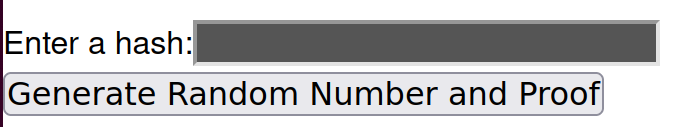

# zk-draw

Verifiable random draw with zero-knowledge of the random seed

## How to run

1. Install dependencies

```
yarn
```

2. Start server

```
yarn dev
```

3. Enter `localhost:3000/` to your browser.

wasm packages are built on x86_64-unknown-linux-gnu.  
For other platforms, change `target` in `circuits/.cargo/config` appropriately, and run `yarn build:wasm` before starting the server.

## How to play

Guess the random lotto number in range [0, 2^32). Keep your input secret until the random number is generated! 0. Calculate [keccak hash](https://emn178.github.io/online-tools/keccak_256.html) of your lotto number.

1. Copy and paste the hash value. Server knows nothing about your lotto number.  
   
2. Generate lucky number. We will also verify that server generated random value correctly. If server didn't generate the random value honestly, verification will fail.  
    
3. If your guess was correct, provide your lotto number as proof. Server will check that your number actually calculates to the hash you committed. If you try to cheat after seeing the random number, the hash wouldn't match so that server will decline your proof.  
    

## Description

Random number generation circuit originates from [halo2-gacha](https://github.com/ssjeon-p/halo2-gacha).  
The idea is based on [linear-congruential-generator](https://en.wikipedia.org/wiki/Linear_congruential_generator),
which gives pseudo-random values from seed. We wrote the circuit with halo2, generating proof that the output random_value
is computed correctly, while server keeps the seed secret.

Our model is based on the situation where the user and server of a game doesn't believe each other. Imagine the gacha (vending machine) games.

- Users don't believe that the server generated the gacha result "randomly".
- If server reveals the random seeds to show honesty, malicious users might capture the trend of seed generation.

We solve the problem with zero-knowledge circuit, where

- User can verify that the random number is the result of random number generator.
- Server can keep the seed secret.

## Maintainers

PSESC_halo2 team @ Ethcon Korea 2023

- Jaewon In ([jae-cuz](https://github.com/jae-cuz))
- Seongsu Jeon ([ssjeon-p](https://github.com/ssjeon-p))
- Minhee Hong ([mmh001](https://github.com/mhh001))
